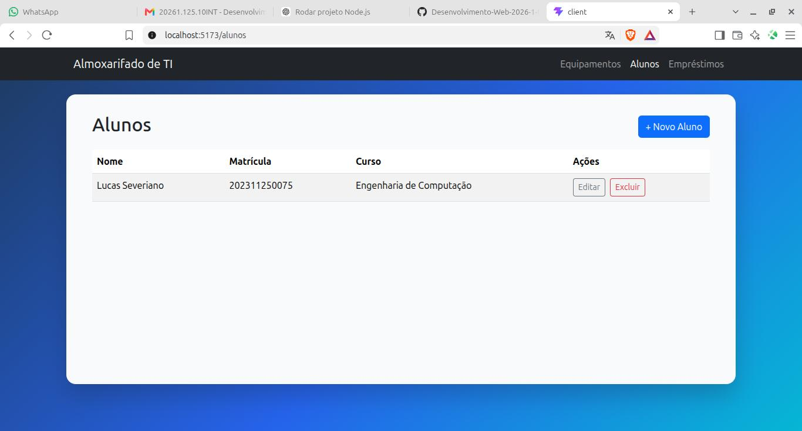
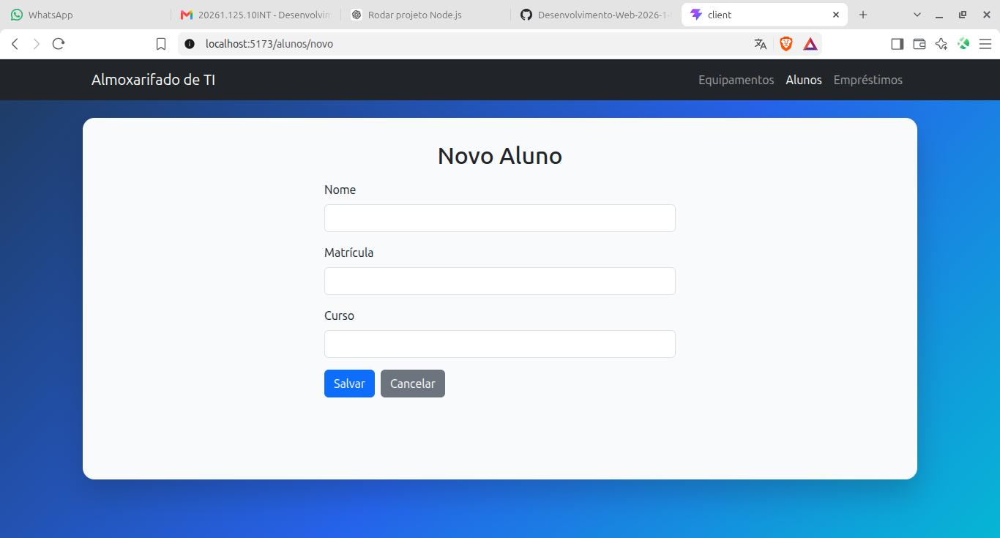
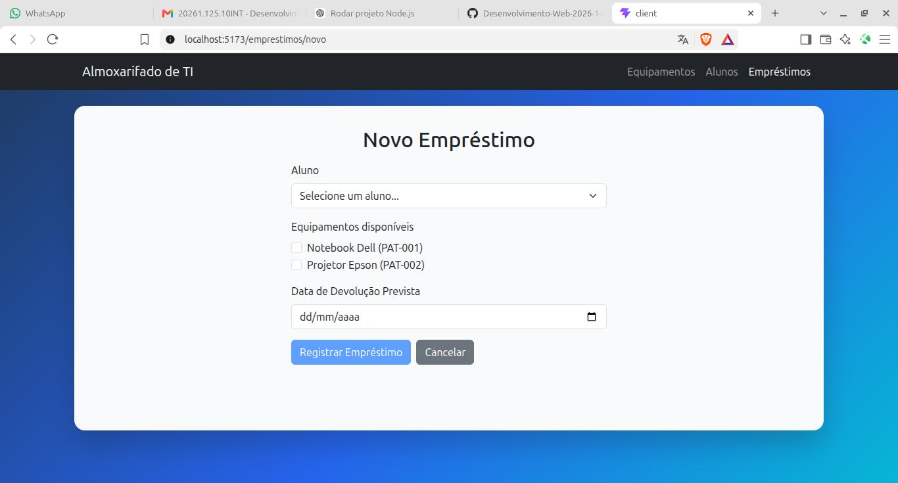

# Almoxarifado de TI — Front-end

Interface web do sistema **Almoxarifado de TI — Sistema de Empréstimo de Equipamentos**, desenvolvida utilizando **React.js** como uma aplicação **SPA (Single Page Application)**.

Este projeto corresponde à camada de apresentação do sistema, sendo responsável pela interação com o usuário e pelo consumo da API REST desenvolvida em Node.js e Express.

> Projeto acadêmico — Avaliação Parcial (P2) de Desenvolvimento Web.
> Tema: **Gestão de Almoxarifado de TI**.

---

## Sobre o projeto

O front-end permite que os usuários interajam visualmente com as funcionalidades disponibilizadas pela API do sistema de Almoxarifado de TI.

A aplicação possibilita:

* Visualizar equipamentos cadastrados;
* Cadastrar equipamentos;
* Editar equipamentos;
* Excluir equipamentos;
* Consultar alunos;
* Cadastrar alunos;
* Editar alunos;
* Excluir alunos;
* Consultar empréstimos;
* Registrar novos empréstimos;
* Registrar devoluções;
* Consultar a disponibilidade dos equipamentos;
* Visualizar mensagens de sucesso, erro e avisos retornados pela API.

A comunicação entre o front-end e o back-end é realizada por meio de requisições HTTP à API REST.

---

## 🛠️ Tecnologias utilizadas

### Front-end

* **React.js** — construção da interface;
* **Vite** — ferramenta de desenvolvimento e build;
* **React Router DOM** — navegação entre as páginas da SPA;
* **Axios** — consumo da API REST;
* **Bootstrap** — estilização e componentes de interface;
* **JavaScript (ES6+)**.

### Back-end

O front-end consome a API desenvolvida utilizando:

* **Node.js**;
* **Express.js**;
* **CORS**;
* Armazenamento em memória.

> A documentação completa do back-end, das regras de negócio e dos endpoints está disponível no [`README.md`](../README.md) da raiz do projeto.

---

## Estrutura do projeto

```text
client/
├── public/
│
├── src/
│   ├── assets/
│   │
│   ├── components/
│   │   └── ...
│   │
│   ├── pages/
│   │   ├── Home/
│   │   ├── Equipamentos/
│   │   ├── Alunos/
│   │   └── Emprestimos/
│   │
│   ├── services/
│   │   └── api.js
│   │
│   ├── App.jsx
│   └── main.jsx
│
├── .gitignore
├── eslint.config.js
├── index.html
├── package.json
└── package-lock.json
```

A estrutura pode ser expandida conforme novas funcionalidades forem implementadas.

---

## ⚙️ Pré-requisitos

Antes de executar o projeto, é necessário ter instalado:

* [Node.js](https://nodejs.org/)
* npm, incluído na instalação do Node.js.

Recomenda-se utilizar **Node.js 18 ou superior**.

Para verificar as versões instaladas:

```bash
node -v
npm -v
```

---

## Instalação

Na raiz do projeto, entre na pasta `client`:

```bash
cd client
```

Instale as dependências:

```bash
npm install
npm install cors
npm install axios react-router-dom bootstrap
```

---

## Executando o front-end

Após instalar as dependências, execute:

```bash
npm run dev
```

O Vite disponibilizará a aplicação em um endereço semelhante a:

```text
http://localhost:5173
```

Abra o endereço apresentado no terminal em um navegador.

---

## Executando o back-end

O front-end depende da API Node.js para funcionar corretamente.

Em outro terminal, na raiz do projeto:

```bash
npm install
npm install express
```

Depois execute:

```bash
npm start
```

A API deverá estar disponível em:

```text
http://localhost:3000
```

### Execução completa

Para utilizar o sistema localmente, mantenha os dois processos em execução:

**Terminal 1 — API:**

```bash
npm start
```

**Terminal 2 — React:**

```bash
cd client
npm run dev
```

Arquitetura da aplicação:

```text
┌─────────────────────────────┐
│       Navegador             │
│                             │
│       React / SPA           │
│   http://localhost:5173     │
└─────────────┬───────────────┘
              │
              │ Axios / HTTP
              │
              ▼
┌─────────────────────────────┐
│      API Node.js            │
│      Express + CORS         │
│   http://localhost:3000     │
└─────────────┬───────────────┘
              │
              ▼
┌─────────────────────────────┐
│       Dados em memória      │
└─────────────────────────────┘
```

---

## Integração com a API

O front-end utiliza **Axios** para realizar as requisições à API.

A URL base utilizada localmente é:

```text
http://localhost:3000
```

Exemplos de endpoints consumidos:

### Equipamentos

```text
GET    /equipamentos
GET    /equipamentos/:id
POST   /equipamentos
PUT    /equipamentos/:id
DELETE /equipamentos/:id
```

### Alunos

```text
GET    /alunos
GET    /alunos/:id
POST   /alunos
PUT    /alunos/:id
DELETE /alunos/:id
```

### Empréstimos

```text
GET    /emprestimos
GET    /emprestimos/:id
POST   /emprestimos
PUT    /emprestimos/:id
```

A documentação detalhada dos endpoints e exemplos de requisições está disponível no README principal e na coleção do Postman.

---

## Comunicação entre Front-end e Back-end

A aplicação utiliza o padrão:

```text
Usuário
   ↓
Interface React
   ↓
Componente/Página
   ↓
Service (Axios)
   ↓
API REST
   ↓
Controller
   ↓
Dados
```

Por exemplo, ao cadastrar um equipamento:

```text
Usuário preenche formulário
          ↓
React captura os dados
          ↓
Axios realiza POST
          ↓
POST /equipamentos
          ↓
API valida os dados
          ↓
Equipamento é cadastrado
          ↓
API retorna resposta
          ↓
React atualiza a interface
```

---

## Gerenciamento de estado

A aplicação utiliza os Hooks do React para controlar os dados e o comportamento das interfaces.

Principais Hooks utilizados:

### `useState`

Utilizado para controlar:

* Dados dos formulários;
* Listas de equipamentos;
* Lista de alunos;
* Lista de empréstimos;
* Mensagens de erro;
* Estados de carregamento.

Exemplo:

```javascript
const [equipamentos, setEquipamentos] = useState([]);
```

### `useEffect`

Utilizado para executar operações quando os componentes são carregados ou quando determinadas informações são alteradas.

Exemplo:

```javascript
useEffect(() => {
    carregarEquipamentos();
}, []);
```

---

## Navegação

A aplicação utiliza **React Router DOM** para realizar a navegação entre as páginas.

A navegação ocorre sem a necessidade de digitar URLs manualmente.

Exemplos de rotas:

```text
/                       → Página inicial
/equipamentos            → Lista de equipamentos
/equipamentos/novo       → Cadastro de equipamento
/equipamentos/:id        → Detalhes/edição
/alunos                  → Lista de alunos
/alunos/novo             → Cadastro de aluno
/alunos/:id              → Detalhes/edição
/emprestimos             → Lista de empréstimos
/emprestimos/novo        → Registro de empréstimo
```

---

## Interface

A interface utiliza **Bootstrap** para fornecer componentes responsivos e manter uma organização visual consistente.

A identidade visual utiliza principalmente:

| Aplicação      | Cor       |
| -------------- | --------- |
| Azul escuro    | `#1E3A5F` |
| Azul principal | `#2563EB` |
| Ciano          | `#06B6D4` |
| Fundo          | `#F8FAFC` |
| Branco         | `#FFFFFF` |
| Texto          | `#172033` |
| Sucesso        | `#16A34A` |
| Alerta         | `#F59E0B` |
| Erro           | `#DC2626` |

As cores de status são utilizadas para facilitar a identificação da situação dos equipamentos:

```text
Disponível     → Verde
Em Uso         → Azul
Em Manutenção  → Âmbar
```

---

## Principais telas

### Página inicial


Apresenta o sistema e fornece acesso às principais áreas da aplicação.

### Equipamentos


Permite consultar os equipamentos cadastrados, visualizar seus status e acessar as operações de cadastro, edição e exclusão.

### Cadastro de equipamento


Formulário utilizado para cadastrar novos equipamentos.

### Alunos



Permite consultar e gerenciar os alunos cadastrados.

### Cadastro de aluno



Formulário utilizado para cadastrar novos alunos.

### Empréstimos


Apresenta os empréstimos registrados e permite realizar operações relacionadas à devolução dos equipamentos.

### Cadastro de Empréstimo



Formulário utilizado para cadastrar novos empréstimos.

---

## Build para produção

Para gerar a versão de produção:

```bash
npm run build
```

Os arquivos gerados serão disponibilizados no diretório:

```text
dist/
```

Para visualizar a build localmente:

```bash
npm run preview
```

---

## Verificação do projeto

Para executar a verificação do ESLint:

```bash
npm run lint
```

Para testar a compilação:

```bash
npm run build
```

---

## Regras de negócio refletidas na interface

O front-end respeita as regras implementadas pela API.

Entre elas:

* Equipamentos `Disponível` podem ser emprestados;
* Equipamentos `Em Uso` não podem ser emprestados;
* Equipamentos `Em Manutenção` não podem ser emprestados;
* Um empréstimo pode possuir mais de um equipamento;
* Um empréstimo está associado a um aluno;
* Ao realizar um empréstimo, os equipamentos passam para `Em Uso`;
* Ao realizar uma devolução, os equipamentos retornam para `Disponível`;
* Empréstimos parciais podem ocorrer quando apenas parte dos equipamentos solicitados está disponível;
* O patrimônio dos equipamentos deve ser único.

A validação das regras de negócio permanece no back-end.

---

## Documentação do projeto

A documentação geral do sistema está disponível no README principal:

[`README.md`](../README.md)

Documentos relacionados:

* [Requisitos básicos](../docs/requisitos_basicos_do_sistema/requisitos_basicos_do_sistema.md)
* [Wireframes](../docs/wireframe/wireframe.md)
* [Diagrama de Classes](../docs/diagrama_de_classes/)
* [Coleção Postman](../Postman/)

---

## Demonstração

Vídeo de demonstração da aplicação:

** [Link do vídeo da P2](https://youtu.be/XnsJvcFVS1Q) **

---

## Release

Versão referente à entrega da P2:

**`v2.0.0-p2`**

Título:

**Entrega P2 - Interface React**

[Consultar Release no GitHub](https://github.com/Desenvolvimento-Web-2026-1-ENG/gestaoAlmoxarifadoTI/releases)

---

## Autor

Projeto desenvolvido para fins acadêmicos por **Lucas Severiano**, graduando em Engenharia de Computação.

## Licença

Este projeto pode ser utilizado para fins educacionais e acadêmicos.
