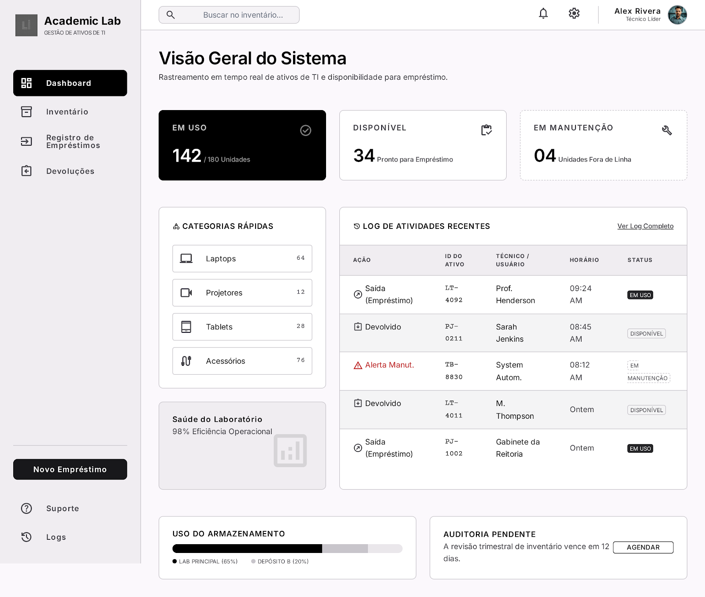
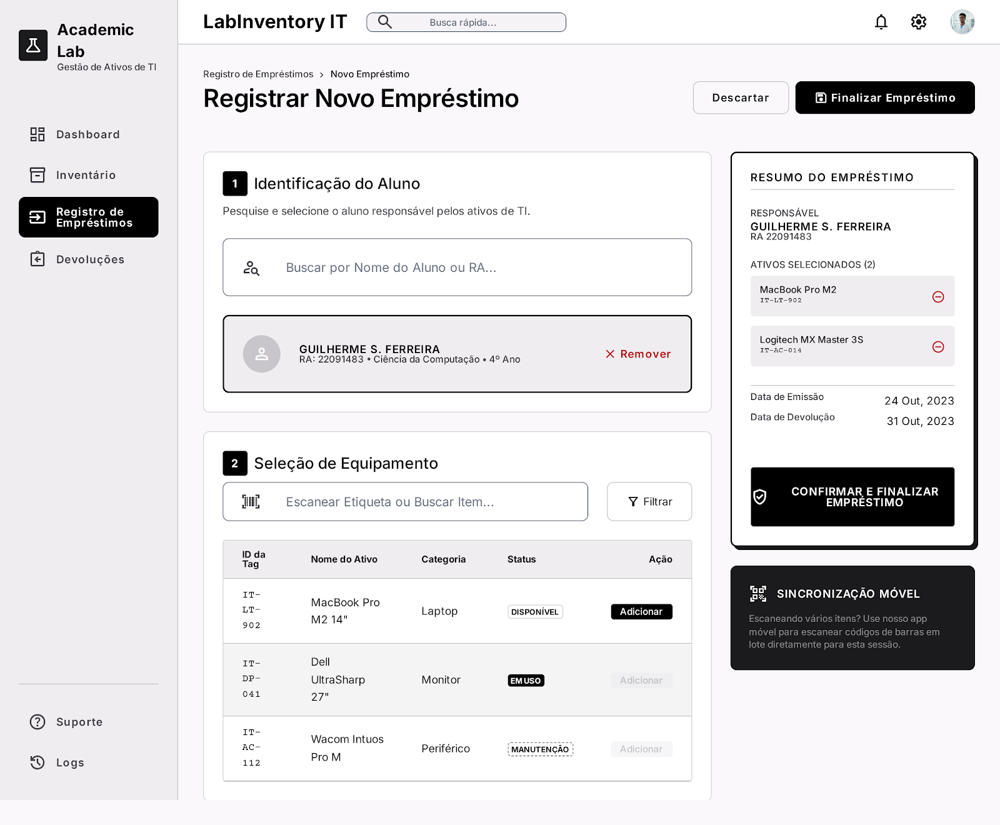
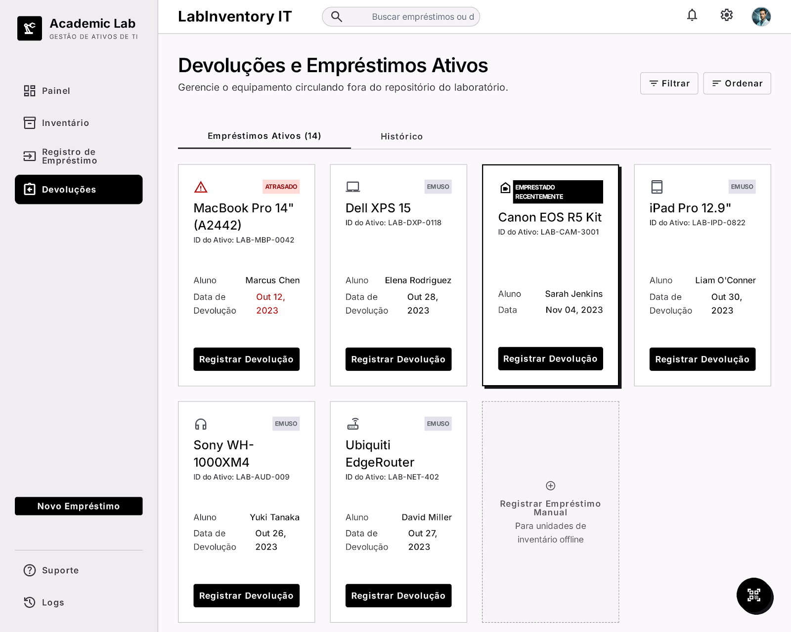
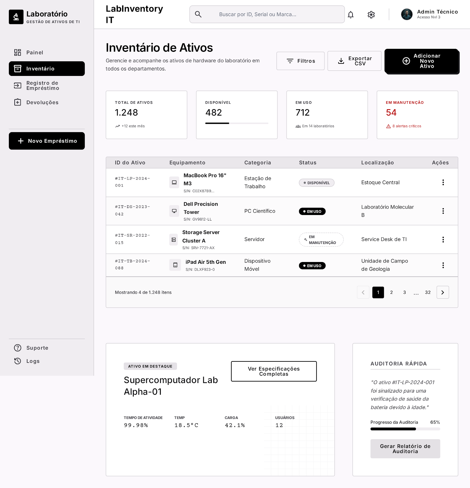

📦 Almoxarifado de TI — Sistema de Empréstimo de Equipamentos

Sistema web para gerenciamento de empréstimos de equipamentos de um laboratório acadêmico, permitindo o controle de disponibilidade, empréstimos, devoluções e manutenção de itens de hardware.

📖 Descrição

O projeto Almoxarifado de TI foi desenvolvido para auxiliar no gerenciamento de equipamentos acadêmicos, como notebooks, projetores e kits de Arduino, garantindo organização, controle de uso e rastreabilidade dos itens emprestados.

O sistema possui dois perfis de acesso:

Técnico (Administrador) — responsável pelo gerenciamento dos equipamentos e empréstimos.
Aluno — responsável por solicitar e utilizar os equipamentos disponíveis.

A principal regra de negócio do sistema impede que equipamentos com status “Em Uso” ou “Em Manutenção” sejam emprestados novamente até sua liberação.

🚀 Funcionalidades
✅ Requisitos Funcionais
Cadastro de equipamentos
Cadastro de categorias de equipamentos
Registro do número de patrimônio
Consulta de disponibilidade em tempo real
Registro de empréstimos
Definição de data prevista para devolução
Registro de devolução
Atualização automática do status do equipamento
Controle de equipamentos em manutenção
Associação de um aluno a um ou mais equipamentos
👥 Perfis de Usuário
🔧 Técnico (Administrador)

Permissões:

Cadastrar equipamentos
Editar informações dos equipamentos
Atualizar status dos itens
Registrar empréstimos
Registrar devoluções
Gerenciar equipamentos em manutenção
🎓 Aluno

Permissões:

Consultar disponibilidade dos equipamentos
Solicitar empréstimos
Visualizar seus empréstimos ativos
🧠 Regras de Negócio
Um equipamento só pode ser emprestado se estiver com status Disponível.

Equipamentos com status:

Em Uso
Em Manutenção

não podem ser emprestados.

Ao registrar um empréstimo:
o status do equipamento deve mudar automaticamente para Em Uso.

Ao registrar uma devolução:
o status do equipamento deve voltar automaticamente para Disponível.
Um empréstimo pode conter um ou mais equipamentos vinculados a um único aluno.

🏗️ Estrutura do Sistema
📦 Entidades Principais
Equipamento
ID
Nome
Número de patrimônio
Categoria
Status
Aluno
ID
Nome
Matrícula
Curso
Empréstimo
ID
Data de saída
Data prevista de devolução
Data de devolução
Aluno responsável
Lista de equipamentos
📊 Status dos Equipamentos
Status	Descrição
Disponível	Equipamento pronto para empréstimo
Em Uso	Equipamento atualmente emprestado
Em Manutenção	Equipamento indisponível para uso

🛠️ Tecnologias Sugeridas
Backend
Java + Spring Boot
Node.js + Express
PHP + Laravel
Frontend
React
Angular
Vue.js
Banco de Dados
MySQL
PostgreSQL
📌 Exemplo de Fluxo de Empréstimo
O técnico consulta os equipamentos disponíveis.
O aluno solicita um ou mais equipamentos.
O técnico registra o empréstimo.
O sistema altera automaticamente o status para Em Uso.
Após a devolução:
o técnico registra o retorno;
o sistema altera o status para Disponível.
🔒 Validações Importantes
Não permitir empréstimo de itens indisponíveis.
Não permitir devolução de itens já disponíveis.
Garantir que cada equipamento possua número de patrimônio único.
Validar datas de devolução.
📁 Objetivo do Projeto

O objetivo deste sistema é melhorar o controle de equipamentos acadêmicos, reduzindo perdas, conflitos de uso e dificuldades no gerenciamento de empréstimos em laboratórios de TI.